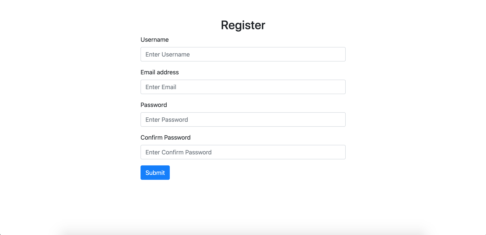
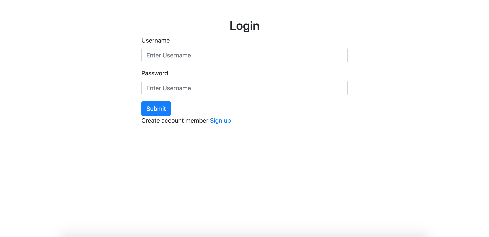

# PHP Basic Login
>Basic login system with PHP

## Table of Contents
  - [Demo](#demo)
  - [Screenshots](#screenshots)
  - [Technologies](#technologies)
  - [Setup](#setup)
  - [Config project](#config-project)
  - [License](#license)

## Demo
Here is a working live demo: [Basic Login Demo](https://gentle-garden-79293.herokuapp.com)
## Screenshots
Example web application page
### Register page

### Login page


## Technologies
Project is created with:
- [php >= 7](https://www.php.net/)
- [Bootstrap 4](https://getbootstrap.com/)


## Setup
To clone this project, you need [Git](https://git-scm.com) to install on your computer. command line below:

```zsh
# Clone this repository
$ git clone https://github.com/Bongkot-Kladklaen/PHP-Basic_Login.git

# Go into the repository
$ cd PHP-Basic_Login
```
## Config project
1. Create database and table :

    Open project `PHP-Basic_Login` find file `basic_login.sql` and Import file to database server for you
2. Config connect database server : 

    Open project `PHP-Basic_Login` find folder: `config>config.php` to config: hostname, username, password, database
 
    ```php
        # Config database connect
        define('DB_HOST', 'localhost');         // hostname
        define('DB_USER', 'root');              // username
        define('DB_PASS', 'root');              // password
        define('DB_NAME', 'basic_login');       // database
    ```

## License
[MIT](LICENSE)
